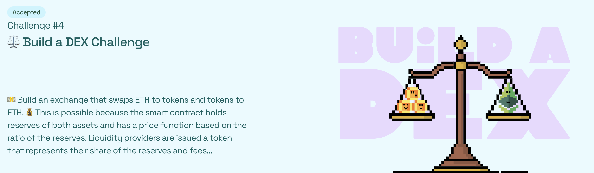
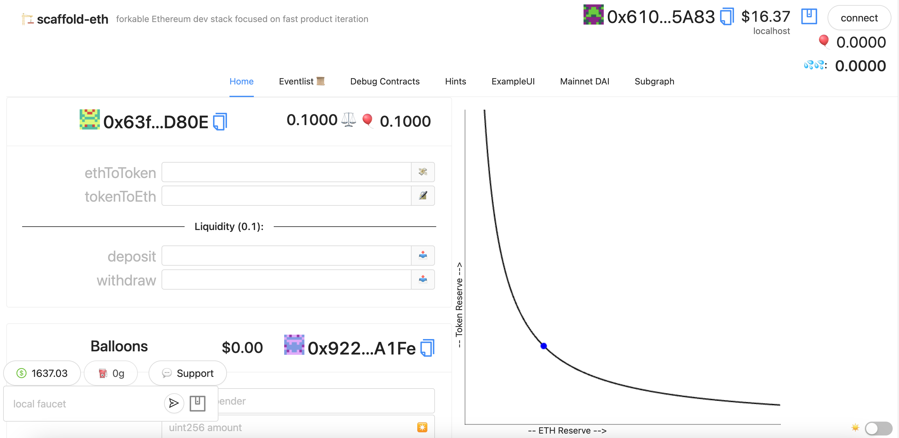

# 🏗 scaffold-eth | 🏰 BuidlGuidl

This challenge will help you build/understand a simple decentralized exchange, with one token-pair (ERC20 BALLOONS ($BAL) and ETH). This repo is an updated version of the [original tutorial](https://medium.com/@austin_48503/%EF%B8%8F-minimum-viable-exchange-d84f30bd0c90) and challenge repos before it. Please read the intro for a background on what we are building first!

**Start by editing the `packages/hardhat/contracts/DEX.sol` contract. This repo also has solutions (👮🏻 try not to peek!) in the Solutions folder, but the challenge is to write the smart contracts yourself of course!**

> ❗️ NOTE: functions outlined within the `packages/hardhat/contracts/DEX.sol` contract are what works with the front end of this branch/repo. Also return variable names may need to be specified exactly as outlined within the `Solutions/DEX.sol` file. If you are confused, see solutions folder in this repo and/or cross reference with front-end code.

Dex Contract
CODE: https://sepolia.etherscan.io/address/0xE20E3B4bfe68Cea5dCCFE72d1fAe749d2872d6Db#code

Balloons Contract:
CODE: https://sepolia.etherscan.io/address/0x4AcBB9d0AfefDC02c9fCD0e41e96233c85Fbbd54#code
DEMO: https://fertile-back.surge.sh/

🚩 🎲 Dex deploy on Ethereum sepolia Testnet 🚩
